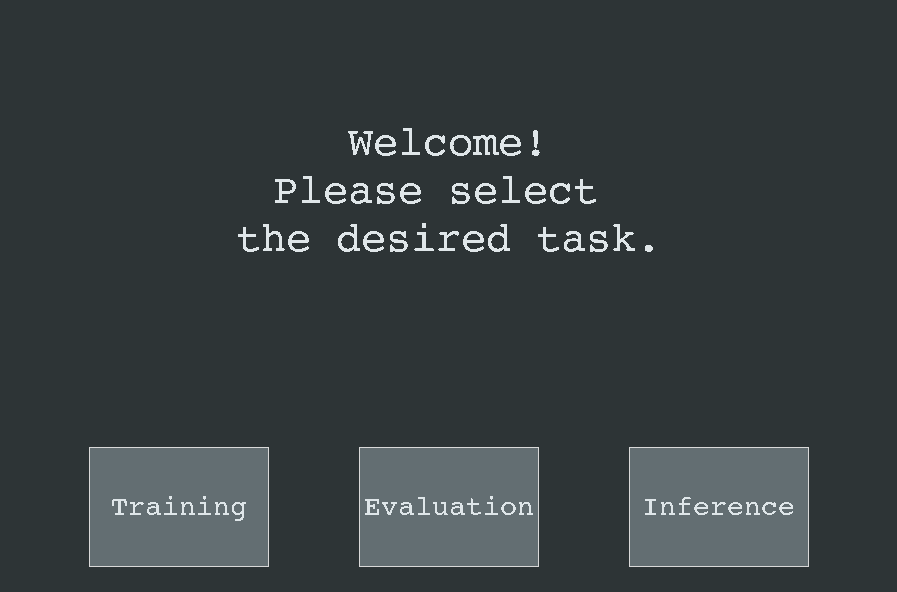
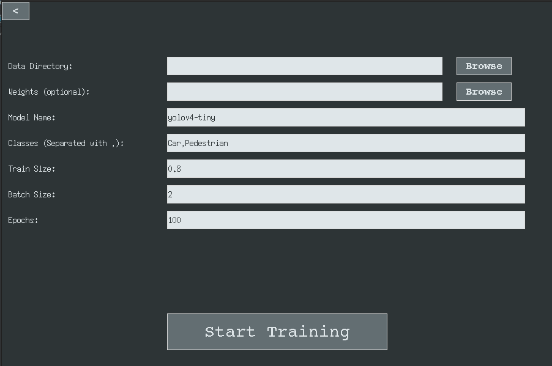
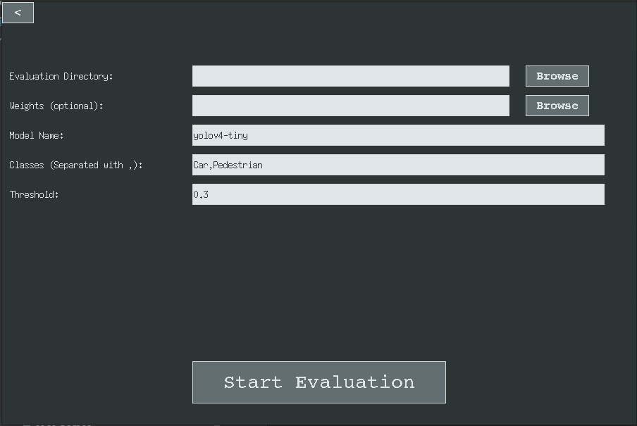
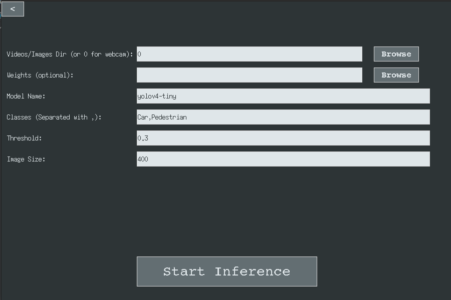

# Yolo GUI app

This app can train, evaluate and inference models such as
yolov4, yolov4-tiny, yolov3 and yolov3-tiny.

The app consists of 3 parts Training, Evaluation, Inference.



## Training
Before training, you need to collect data to train on.

### Data

In the **data folder**, 
there must be images and annotations to them 
(with the same names).

for example:
```
data_dir/
├── 000000.png
├── 000000.txt
├── 000001.png
├── 000001.txt
...
├── 011256.png
└── 011256.txt
```

**Annotations** must be in standard yolo format ie ```<cls> <x> <y> <w> <h>```
where cls is the index of class,
x is the x coord of the center of the bounding box divided by the width of the image, 
y is the y coord divided by image height,
w is the width of the box divided by the image width,
and w is the height of the box divided by the image height.


For example in this image annotations file will be like this
```
0 0.48 0.63 0.69 0.71
0 0.68 0.57 0.31 0.96
1 0.84 0.48 0.13 0.45
```
where class 0 is the 'person' class and 1 is 'tie'.

**Images** must be in '.jpg' or '.png' formats.


### Training parameters

In training page there are 7 parameters (entries).




***1. Data Directory:***

Path to the data folder.


***2. Weights:***

Model's weights path. If you already trained a model and want to 
continue training from the last checkpoint then you don't need it.

You can download coco trained weights from here.

[yolov4](https://github.com/AlexeyAB/darknet/releases/download/darknet_yolo_v3_optimal/yolov4.weights)
[yolov4-tiny](https://github.com/AlexeyAB/darknet/releases/download/darknet_yolo_v4_pre/yolov4-tiny.weights)
[yolov3](https://pjreddie.com/media/files/yolov3.weights)
[yolov3-tiny](https://pjreddie.com/media/files/yolov3-tiny.weights)

***3. Model name:***

The name of model you want to train.

yolov4, yolov4-tiny, yolov3, or yolov3-tiny


***4. Classes:***

Training class names separated with comas (,).

NOTE: the order of classes must match data

***5. Train Size:***

The app will randomly split the data to train and test datasets.

This parameter specifies what is the proportions of train and test sets.

For example if Train Size is 0.8 then the 80% of data 
will be used for training and 20% for testing.

***6. Batch Size:***

Training goes with batches.

How large is the batch size, how high is the training accuracy.
But for large batches, we need a GPU with large memory.

***7. Epochs***

How many epochs your model will be trained.


Typically, you don't need to change epochs, batch size and train size.

When the tutorial starts, the app opens 
the tensorboard in your browser. 
Here you can see the details of training.

While Training the app saves checkpoints in ```checkpoints/``` directory


## Evaluation

Here you can evaluate your models in your test dataset.

Before evaluation, you need to collect data as we discussed above.

In evaluation page there are 5 parameters (entries).




***1. Evaluation Directory:***

Path to the data folder.

***2. Weights:***

The same as in training.

***3. Model name:***

The same as in training.

***4. Classes:***

The same as in training.


***5. Threshold:***

Object confidence threshold.
The model gives confidence to its predictions.
For example, if the threshold = 0.3, we say
that the detected object is "real" if the confidence is greater than 0.3

Typically, you don't need to change threshold.

After evaluation, you can find the results in ```mAP/``` folder.


## Inference

Here you can run your models in your images or videos.

In evaluation page there are 6 parameters (entries).




***1. Videos/Images Directory:***

Path to the folder where are your videos and images
you want to inference with.

If you want to inference with the webcam just type 0.

***2. Weights:***

The same as in training.

***3. Model name:***

The same as in training.

***4. Classes:***

The same as in training.


***5. Threshold:***

The same as in evaluation.


***6. Image size:***

Size of the inference window.

Typically, you don't need to change threshold.

After inference, you can find the results in ```predictions/``` folder.
